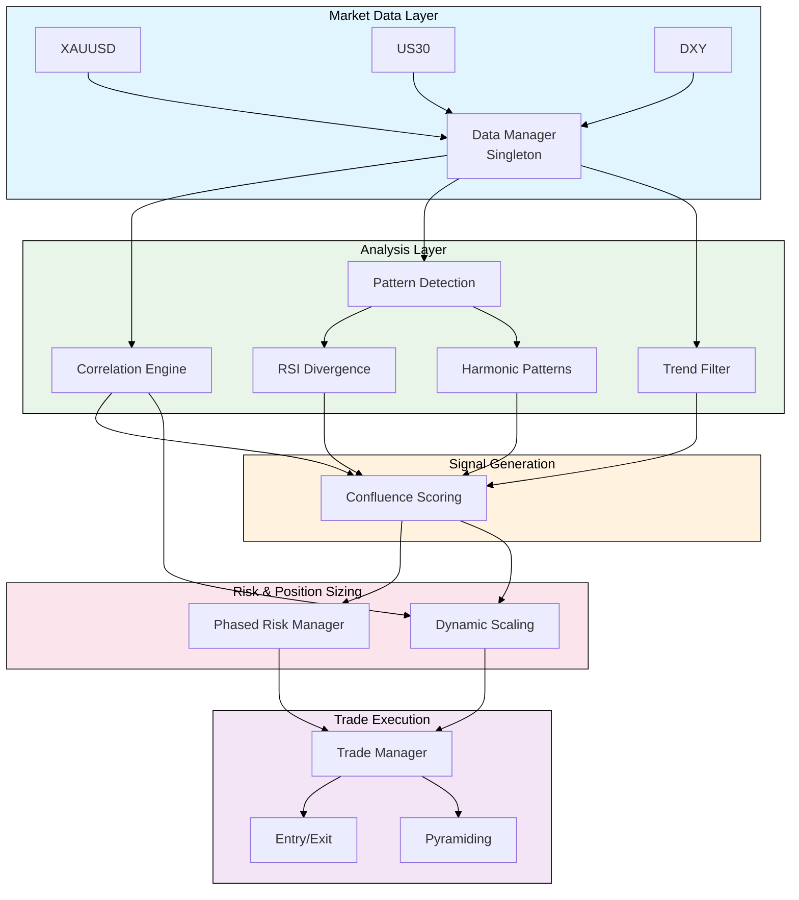
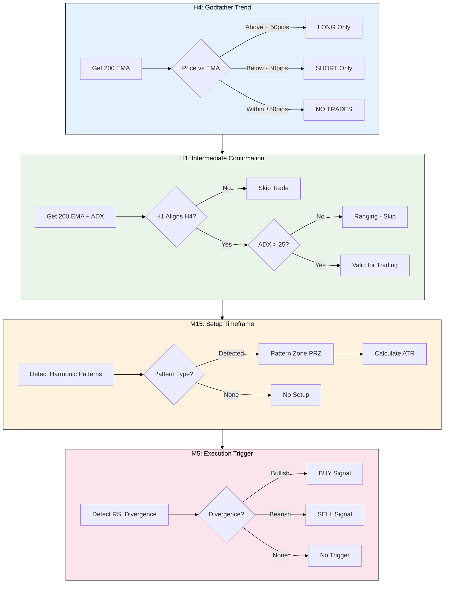
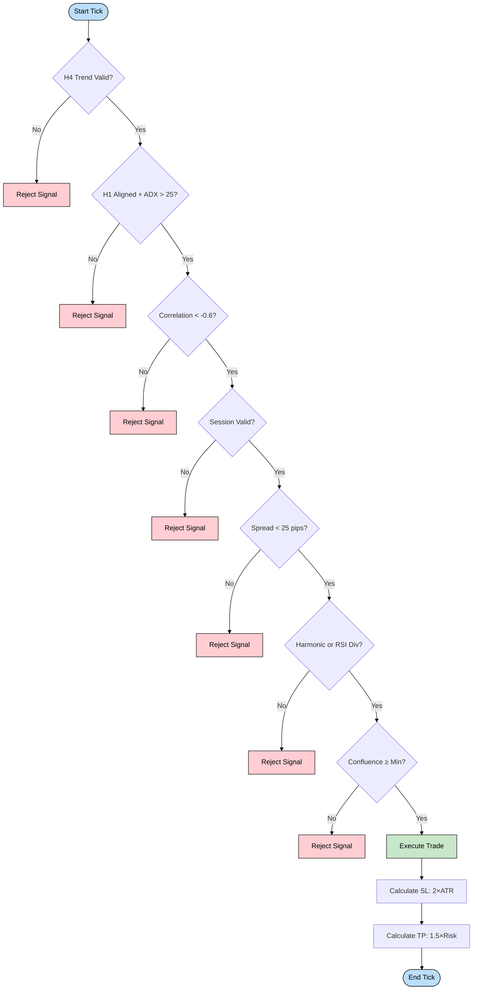
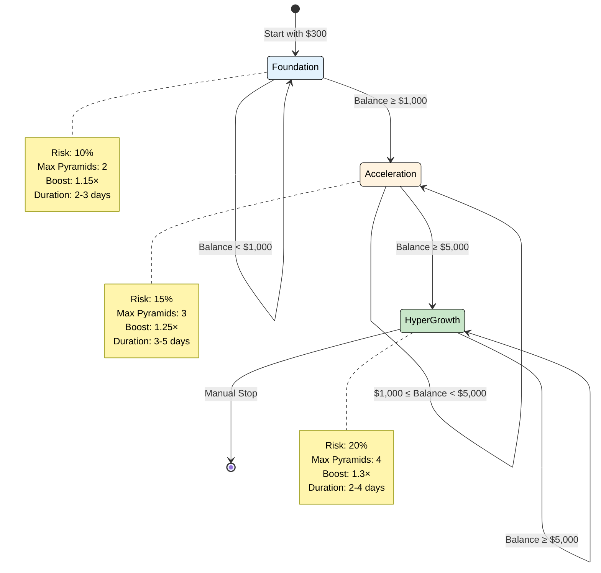
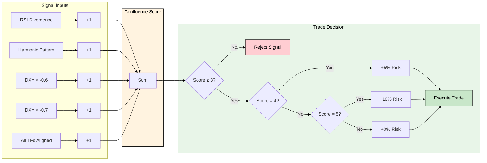
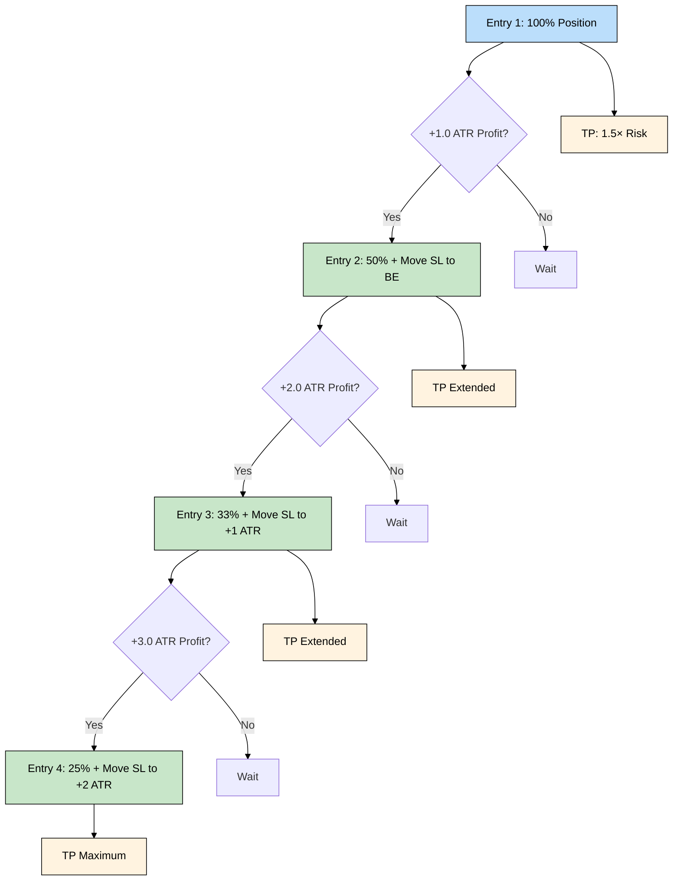
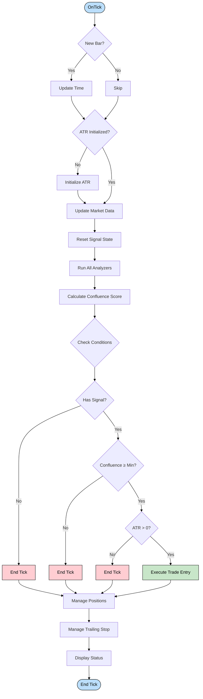
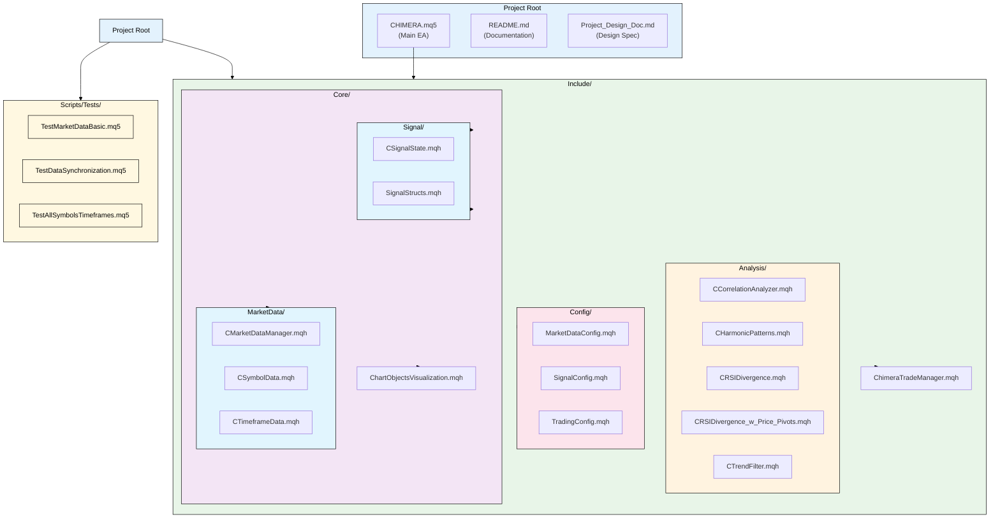

# CHIMERA - Advanced Algorithmic Trading System

**Version:** 1.3
**Platform:** MetaTrader 5
**Author:** KeyAlgos
**Website:** https://keyalgos.com

---

## Table of Contents

1. [Project Overview](#project-overview)
2. [System Architecture](#system-architecture)
3. [Key Features](#key-features)
4. [Multi-Asset Analysis System](#multi-asset-analysis-system)
5. [Trading Strategy Framework](#trading-strategy-framework)
6. [Pattern Detection Engine](#pattern-detection-engine)
7. [Risk Management & Compounding](#risk-management--compounding)
8. [Technical Implementation](#technical-implementation)
9. [Installation & Setup](#installation--setup)
10. [Configuration](#configuration)
11. [Testing](#testing)
12. [File Structure](#file-structure)
13. [Troubleshooting](#troubleshooting)

---

## Project Overview

### Purpose and Scope

CHIMERA is an advanced algorithmic trading Expert Advisor (EA) designed for capital growth through intelligent multi-asset analysis and phased compounding. The system implements a sophisticated correlation-based strategy by analyzing three instruments simultaneously (XAUUSD, US30, DXY) while executing trades only on XAUUSD (Gold).

### Core Philosophy: Institutional-Grade Confluence Trading

CHIMERA does not trade on a single indicator or pattern. It trades on **confluence** — the alignment of multiple, independent signals that together create a high-probability setup. This is how institutional traders and hedge funds operate.

A trade is only executed when ALL of the following conditions are met:

1. ✅ **H4/H1 Trend Alignment** — The macro trend is in our favor
2. ✅ **DXY Correlation Confirmation** — The dollar is moving in the opposite direction (< -0.6 correlation)
3. ✅ **M15 Harmonic Pattern OR M5 RSI Divergence** — A high-probability reversal signal has formed
4. ✅ **Session Filter** — Trading during London or NY session (high liquidity)
5. ✅ **Spread Filter** — Spread is below 25 pips (cost control)

When all five align, we have an A++ setup worthy of aggressive position sizing.

---

## System Architecture

### High-Level Architecture



### Component Overview

| Component | File | Description |
|-----------|------|-------------|
| Main EA | [`CHIMERA.mq5`](CHIMERA.mq5) | Entry point, initialization, and main trading loop |
| Market Data Manager | [`CMarketDataManager.mqh`](Include/Core/MarketData/CMarketDataManager.mqh) | Singleton managing multi-symbol, multi-timeframe data |
| Signal State | [`CSignalState.mqh`](Include/Core/Signal/CSignalState.mqh) | Singleton storing all signal states for scoring |
| RSI Divergence | [`CRSIDivergence.mqh`](Include/Analysis/CRSIDivergence.mqh) | Detects bullish/bearish RSI divergences using pivot analysis |
| Correlation Analyzer | [`CCorrelationAnalyzer.mqh`](Include/Analysis/CCorrelationAnalyzer.mqh) | Calculates Gold-DXY correlation for signal boosting |
| Harmonic Patterns | [`CHarmonicPatterns.mqh`](Include/Analysis/CHarmonicPatterns.mqh) | Detects Gartley, Bat, ABCD, and Cypher patterns |
| Trend Filter | [`CTrendFilter.mqh`](Include/Analysis/CTrendFilter.mqh) | Multi-timeframe trend analysis (H4/H1) |
| Trade Manager | [`ChimeraTradeManager.mqh`](Include/Trading/ChimeraTradeManager.mqh) | Execution, risk management, pyramiding, and exits |

---

## Key Features

### 1. Multi-Asset Correlation Analysis
- Uses DXY (US Dollar Index) as a primary signal filter
- Correlation threshold: -0.6 (inverse correlation required)
- Signal boost multiplier: 1.0× to 1.3× based on correlation strength

### 2. Phased Compounding System
Progressive risk scaling based on account growth milestones:

| Phase | Balance Range | Risk Per Trade | Max Pyramid Entries | Correlation Boost |
|-------|---------------|----------------|----------------------|-------------------|
| Foundation | $300 → $1,000 | 10% | 2 | Up to 1.15× |
| Acceleration | $1,000 → $5,000 | 15% | 3 | Up to 1.25× |
| Hyper-Growth | $5,000+ | 20% | 4 | Up to 1.3× |

### 3. Advanced Pattern Detection
- **RSI Divergence** (Primary signal on M5): Detects momentum exhaustion
- **Harmonic Patterns** (Setup signal on M15): Gartley, Bat, ABCD, Cypher

### 4. Multi-Timeframe Intelligence
- **H4**: Godfather trend (200 EMA)
- **H1**: Intermediate confirmation (200 EMA + ADX)
- **M15**: Setup timeframe (Harmonic patterns + ATR)
- **M5**: Execution timeframe (RSI Divergence trigger)

### 5. Dynamic Risk Scaling
Position size amplification based on signal quality and confluence score.

### 6. Pyramiding Logic
Add to winning positions at strategic levels to maximize R:R ratio.

### 7. Zero User Input
Fully autonomous operation after deployment.

---

## Multi-Asset Analysis System

### Overview

The CHIMERA Multi-Asset Analysis System analyzes three instruments simultaneously while executing trades on only one, providing enhanced market intelligence and superior signal quality through sophisticated cross-asset correlation analysis.

### System Configuration

| Symbol | Type | Purpose |
|--------|------|---------|
| XAUUSD | Tradeable | Gold - Primary trading instrument |
| US30 | Analysis Only | Dow Jones - Secondary confirmation |
| DXY | Correlation Filter | US Dollar Index - Primary signal filter |

### Operational Benefits

1. **Enhanced Signal Quality**
   - Cross-asset confirmation: All trading signals are validated against DXY correlation
   - Correlation boost: Strong correlations between Gold and DXY amplify signal strength
   - False signal filtering: Multi-asset analysis eliminates low-quality signals
   - Market regime detection: Uses all three symbols for comprehensive market analysis

2. **Superior Performance Metrics**
   - Signal quality: Enhanced through multi-dimensional market analysis
   - Risk management: Improved through correlation-based position sizing
   - Drawdown reduction: Better risk distribution across correlated assets

### Correlation Analysis Engine

The system continuously monitors correlations between symbols using a 50-period rolling window:

| Correlation Range | Interpretation | Action |
|-------------------|---------------|--------|
| -0.6 to -0.8 | Expected range | Valid for trading |
| < -0.6 | Inverse correlated | Threshold met (signal boost enabled) |
| ≥ -0.6 | Weak correlation | No trade |

**Signal Boost Calculation:**
```
boost = 1.0 + (|correlation| - 0.6) × 1.5
// -0.6 = 1.0× (no boost)
// -0.7 = 1.15×
// -0.8 = 1.3× (maximum boost)
```

---

## Trading Strategy Framework

### Multi-Timeframe Hierarchy



### Entry Decision Flow



### Entry Conditions

#### LONG Entry (Buy Gold)

ALL of the following must be true:

1. H4 Trend: Price > 200 EMA on H4
2. H1 Confirmation: Price > 200 EMA on H1 AND ADX > 25
3. DXY Correlation: Gold-DXY correlation < -0.6 (inverse)
4. DXY Direction: DXY is falling (confirming Gold strength)
5. M15 Harmonic Pattern: Bullish Gartley, Bat, or ABCD detected at PRZ
6. M5 RSI Divergence: Bullish divergence (price lower low, RSI higher low)
7. Session: London (08:00-17:00 GMT) or NY (13:00-22:00 GMT)
8. Spread: < 25 pips

**Entry Execution:**
- Enter at market when M5 RSI divergence is confirmed
- Place stop loss at 2.0 × ATR(14) below entry
- Set initial take profit at 1.5 × risk (1:1.5 R:R)
- Activate trailing stop after 1.0 × ATR profit

#### SHORT Entry (Sell Gold)

ALL of the following must be true:

1. H4 Trend: Price < 200 EMA on H4
2. H1 Confirmation: Price < 200 EMA on H1 AND ADX > 25
3. DXY Correlation: Gold-DXY correlation < -0.6 (inverse)
4. DXY Direction: DXY is rising (confirming Gold weakness)
5. M15 Harmonic Pattern: Bearish Gartley, Bat, or ABCD detected at PRZ
6. M5 RSI Divergence: Bearish divergence (price higher high, RSI lower high)
7. Session: London (08:00-17:00 GMT) or NY (13:00-22:00 GMT)
8. Spread: < 25 pips

**Entry Execution:**
- Enter at market when M5 RSI divergence is confirmed
- Place stop loss at 2.0 × ATR(14) above entry
- Set initial take profit at 1.5 × risk (1:1.5 R:R)
- Activate trailing stop after 1.0 × ATR profit

### Exit Conditions

1. **Stop Loss Hit**
   - Fixed stop loss at 2.0 × ATR from entry
   - Never moved closer to entry
   - Can be moved to breakeven after 1.0 × ATR profit

2. **Take Profit Hit**
   - Initial TP at 1.5 × risk
   - Can be extended via pyramiding

3. **Trailing Stop Hit**
   - Activated after 1.0 × ATR profit
   - Trails at 1.0 × ATR distance

4. **Trend Reversal**
   - If H1 price crosses 200 EMA in opposite direction
   - If M15 shows counter-trend harmonic pattern

5. **Correlation Breakdown**
   - If Gold-DXY correlation rises above -0.4 (relationship weakening)

---

## Pattern Detection Engine

### RSI Divergence Detection

#### What is RSI Divergence?

RSI Divergence occurs when price action and the RSI indicator move in opposite directions, signaling momentum exhaustion and an impending reversal.

**Bullish Divergence:**
- Price makes a lower low
- RSI makes a higher low
- Signal: Momentum is weakening to the downside, expect reversal up

**Bearish Divergence:**
- Price makes a higher high
- RSI makes a lower high
- Signal: Momentum is weakening to the upside, expect reversal down

#### Implementation Parameters

| Parameter | Value |
|-----------|-------|
| Period | 9 |
| Applied to | Close price |
| Timeframe | M5 (execution timeframe) |
| Oversold Level | 40 |
| Overbought Level | 60 |
| Pivot Left | 5 bars |
| Pivot Right | 5 bars |

**Frequency:** ~25-35 divergences per day on M5 (high opportunity count)

### Harmonic Pattern Detection

Harmonic patterns are geometric price formations based on Fibonacci ratios that predict high-probability reversal zones (PRZ - Potential Reversal Zone). They are predictive, not reactive, meaning they tell you WHERE a reversal will happen BEFORE it occurs.

#### The Four Core Patterns

| Pattern | Frequency (M15) | Key Ratio | Direction |
|---------|------------------|-----------|-----------|
| ABCD | ~60-70/day | 1.27-1.618 BC | Bidirectional |
| Gartley | ~2-4/day | 0.786 XA | Bidirectional |
| Bat | ~3-5/day | 0.886 XA | Bidirectional |
| Cypher | ~1-3/day | 0.786 XC | Bidirectional |

#### Pattern Structures

**ABCD Pattern:**
- Point A: Initial swing high/low
- Point B: Retracement (0.382-0.886 of AB)
- Point C: Extension (1.13-2.618 of AB)
- Point D: PRZ (1.27-1.618 of BC)

**Gartley Pattern:**
- AB = 0.618 of XA
- BC = 0.382-0.886 of AB
- CD = 1.27-1.618 of BC
- AD = 0.786 of XA (critical)

**Bat Pattern:**
- AB = 0.382-0.50 of XA
- BC = 0.382-0.886 of AB
- CD = 1.618-2.618 of BC
- AD = 0.886 of XA (critical)

**Cypher Pattern:**
- AB = 0.382-0.618 of XA
- BC = 1.13-1.414 extension of XA
- CD = 0.786 of XC (critical)

---

## Risk Management & Compounding

### Phased Compounding System

This is the core growth engine of CHIMERA.



#### Phase 1: Foundation ($300 → $1,000)

**Goal:** Build a cushion and survive early volatility.

**Parameters:**
- Base Risk: 10% per trade
- Max Pyramid Entries: 2
- Correlation Boost: Enabled (up to 1.15×)
- Target: $1,000 (3.33× growth)

**Why 10% risk?**
- With a $300 account, 10% = $30 risk per trade
- Conservative approach ensures account survival
- Conservative start ensures we don't blow up early

**Expected Duration:** 5-7 trades (2-3 days)

#### Phase 2: Acceleration ($1,000 → $5,000)

**Goal:** Aggressive growth with an established base.

**Parameters:**
- Base Risk: 15% per trade
- Max Pyramid Entries: 3
- Correlation Boost: Enabled (up to 1.25×)
- Target: $5,000 (5× growth from Phase 1)

**Why 15% risk?**
- We now have a $1,000 cushion
- Can afford to lose a trade and recover
- Accelerates compounding significantly

**Expected Duration:** 8-10 trades (3-5 days)

#### Phase 3: Hyper-Growth ($5,000+)

**Goal:** Maximum aggression to reach target.

**Parameters:**
- Base Risk: 20% per trade
- Max Pyramid Entries: 4
- Correlation Boost: Enabled (up to 1.3×)
- Target: Continue aggressive growth

**Why 20% risk?**
- Account is large enough to absorb losses
- Final push to target requires maximum aggression

**Expected Duration:** 5-8 trades (2-4 days)

### Dynamic Risk Scaling: Bet Big on A++ Setups

Not all trades are created equal. A trade with 5 confluences is better than a trade with 3. We should risk more on the better trades.

#### Confluence Scoring System



**Maximum Confluence Score:** 5 points

#### Risk Multiplier Based on Confluence

| Confluence Score | Risk Bonus |
|-----------------|-------------|
| 3 | +0% (minimum tradeable setup) |
| 4 | +5% |
| 5 | +10% (A++ setup) |

**Example:**
- Phase 2 (Acceleration): Base risk = 15%
- Confluence score = 5 (perfect setup)
- Final risk = 15% + 10% = 25% of account on this trade

This is how we accelerate growth on the best setups.

### Pyramiding Logic

Pyramiding allows us to add to winning positions, turning a 1:1.5 R:R trade into a 1:5 or 1:10 R:R trade.



#### Rules

1. **First Entry:** Full position size based on phased risk
2. **Second Entry:** 50% of first entry, added at +1.0 × ATR profit
3. **Third Entry:** 33% of first entry, added at +2.0 × ATR profit
4. **Fourth Entry:** 25% of first entry, added at +3.0 × ATR profit (Phase 3 only)

**Stop Loss Management:**
- After first pyramid entry, move initial SL to breakeven
- After second pyramid entry, move SL to +1.0 × ATR
- After third pyramid entry, move SL to +2.0 × ATR

---

## Technical Implementation

### OnTick Processing Flow



### Prerequisites

- **Platform:** MetaTrader 5 (Build 3802 or higher)
- **Broker:** IC Markets (Raw Spread Account)
- **Language:** MQL5
- **Architecture:** Object-Oriented Programming (OOP)

### Class Structure

The system uses several core classes organized in a modular architecture:

#### CMarketDataManager (Singleton)

The central data hub that manages all market data for multiple symbols and timeframes.

```cpp
class CMarketDataManager {
private:
    static CMarketDataManager* s_instance;  // Singleton instance
    CMarketDataConfig* m_config;
    CSymbolData* m_symbols[];               // Array of symbol data objects
    string m_symbol_map[];                  // Maps symbol name to array index

public:
    static CMarketDataManager* GetInstance(void);
    bool UpdateAll(void);
    double Close(string symbol, ENUM_TIMEFRAMES tf, int shift = 0);
    // ... additional methods
};
```

#### CSignalState (Singleton)

Stores all signal states for confluence scoring.

```cpp
class CSignalState {
private:
    static CSignalState* s_instance;
    SRSIDivergenceResult m_rsi;
    SCorrelationResult m_correlation;
    SHarmonicPatternResult m_harmonic;
    STrendResult m_trend;
    SFilterResult m_filters;

public:
    static CSignalState* GetInstance(void);
    void SetRSIDivergence(const SRSIDivergenceResult& result);
    void SetCorrelation(const SCorrelationResult& result);
    void SetHarmonic(const SHarmonicPatternResult& result);
    // ... additional methods
};
```

#### CRSIDivergence

Detects RSI divergences using pivot point analysis.

```cpp
class CRSIDivergence {
private:
    CMarketDataManager* m_data;
    string m_symbol;
    ENUM_TIMEFRAMES m_timeframe;
    int m_rsi_period;
    int m_pivot_left;
    int m_pivot_right;
    int m_rsi_handle;
    SPivotPoint m_rsi_pivots[];

public:
    bool Initialize(CMarketDataManager* data_manager, const SRSIConfig& config);
    void Analyze(SRSIDivergenceResult& result, bool is_new_bar);
    double GetCurrentRSI(void);
    int GetRSIPivotCount(void) const;
};
```

#### CChimeraTradeManager

Handles trade execution, risk management, and pyramiding.

```cpp
class CChimeraTradeManager {
private:
    CTrade m_trade;
    CPositionInfo m_position;
    CSymbolInfo m_symbol;
    ChimeraConfig m_cfg;

public:
    CChimeraTradeManager(ChimeraConfig& trade_config, SFilterConfig& filter_config);
    void ExecuteEntry(ENUM_ORDER_TYPE type, double sl_price, int confluence_score,
                     double current_correlation, datetime correlation_time);
    void ManagePositions(double current_atr, double current_correlation,
                        datetime correlation_time, datetime atr_time);
    void ManageTrailingStop(double current_atr, datetime atr_time);
};
```

### Data Structures

#### Signal Result Structures

```cpp
struct SRSIDivergenceResult {
    bool detected;
    bool is_bullish;
    double rsi_current;
    double rsi_previous;
    int bars_between;
    datetime detection_time;
};

struct SCorrelationResult {
    double value;
    bool meets_threshold;     // < -0.6
    bool is_strong;          // < -0.7
    double signal_boost;     // 1.0 - 1.3
};

struct SHarmonicPatternResult {
    bool XABCD_structure_valid;
    bool is_bullish;
    bool any_pattern_detected;
    SHarmonicPattern gartley;
    SHarmonicPattern bat;
    SHarmonicPattern abcd;
    SHarmonicPattern cypher;
    
    int GetTriggeredCount();
};

struct STrendResult {
    int h4_direction;        // -1, 0, 1
    int h1_direction;        // -1, 0, 1
    bool h4_h1_aligned;
    double adx_value;
    bool is_trending;
};
```

#### Configuration Structures

```cpp
struct ChimeraConfig {
    string symbol_trade;
    ulong magic_number;
    double balance_phase_1_limit;
    double balance_phase_2_limit;
    double phase_1_risk;
    double phase_2_risk;
    double phase_3_risk;
    int phase_1_max_pyramids;
    int phase_2_max_pyramids;
    int phase_3_max_pyramids;
    int atr_period;
    double sl_atr_multiplier;
    double tp_atr_multiplier;
    int max_deviation_points;
};

struct SRSIConfig {
    bool enabled;
    string symbol;
    ENUM_TIMEFRAMES timeframe;
    int rsi_period;
    int pivot_left;
    int pivot_right;
    int max_divergence_bars;
    double oversold;
    double overbought;
};

struct SCorrelationConfig {
    bool enabled;
    int symbol1_index;
    int symbol2_index;
    ENUM_TIMEFRAMES timeframe;
    int period;
    double threshold;         // -0.6
    double strong_threshold; // -0.7
};
```

---

## Installation & Setup

### Step 1: Install MetaTrader 5

1. Download and install MetaTrader 5 from your broker or [MetaQuotes](https://www.metatrader5.com/)
2. Open MT5 and log in to your trading account
3. Ensure you have IC Markets Raw Spread account

### Step 2: Copy Files

Copy the entire project structure to your MetaTrader 5 experts folder:

```
MetaTrader 5/MQL5/Experts/Project_Chimera/
├── CHIMERA.mq5
├── Include/
│   ├── Analysis/
│   │   ├── CCorrelationAnalyzer.mqh
│   │   ├── CHarmonicPatterns.mqh
│   │   ├── CRSIDivergence.mqh
│   │   ├── CRSIDivergence_w_Price_Pivots.mqh
│   │   └── CTrendFilter.mqh
│   ├── Config/
│   │   ├── MarketDataConfig.mqh
│   │   ├── SignalConfig.mqh
│   │   └── TradingConfig.mqh
│   ├── Core/
│   │   ├── MarketData/
│   │   │   ├── CMarketDataManager.mqh
│   │   │   ├── CSymbolData.mqh
│   │   │   └── CTimeframeData.mqh
│   │   ├── Signal/
│   │   │   ├── CSignalState.mqh
│   │   │   └── SignalStructs.mqh
│   │   └── VisualizationLibrary/
│   │       └── ChartObjectsVisualization.mqh
│   └── Trading/
│       └── ChimeraTradeManager.mqh
└── Scripts/
    └── Tests/
        ├── TestAllSymbolsTimeframes.mq5
        ├── TestDataSynchronization.mq5
        └── TestMarketDataBasic.mq5
```

### Step 3: Compile the EA

1. In MetaTrader 5, press `Ctrl+O` to open the Navigator
2. Navigate to `Experts > Project_Chimera`
3. Double-click `CHIMERA.mq5` to open in editor
4. Press `F7` or click Compile button
5. Ensure no compilation errors

### Step 4: Enable Trading

1. Go to `Tools > Options` or press `Ctrl+O`
2. In the `Expert Advisors` tab:
   - Check "Allow live trading"
   - Check "Allow DLL imports" (if needed)
3. Click OK

### Step 5: Attach to Chart

1. In MetaTrader 5, open a chart for XAUUSD (Gold)
2. Right-click on the chart and select `Experts > Attach to chart`
3. Or drag and drop CHIMERA.ex5 from the Navigator onto the chart
4. Configure input parameters if prompted
5. Enable "Live trading" button (green play icon) in the EA panel

---

## Configuration

### Trading Configuration ([`TradingConfig.mqh`](Include/Config/TradingConfig.mqh))

The main trading parameters are configured in TradingConfig.mqh:

| Parameter | Description | Default |
|-----------|-------------|---------|
| `symbol_trade` | Trading symbol | "XAUUSD" |
| `magic_number` | Expert magic number | 20260315 |
| `balance_phase_1_limit` | Phase 1 upper limit | 1000 |
| `balance_phase_2_limit` | Phase 2 upper limit | 5000 |
| `phase_1_risk` | Phase 1 risk % | 0.10 |
| `phase_2_risk` | Phase 2 risk % | 0.15 |
| `phase_3_risk` | Phase 3 risk % | 0.20 |
| `atr_period` | ATR period | 14 |
| `sl_atr_multiplier` | Stop loss ATR multiplier | 2.0 |
| `tp_atr_multiplier` | Take profit ATR multiplier | 1.5 |

### Signal Configuration ([`SignalConfig.mqh`](Include/Config/SignalConfig.mqh))

Signal detection parameters are configured in SignalConfig.mqh:

**RSI Divergence Settings:**
| Parameter | Description | Default |
|-----------|-------------|---------|
| `rsi_period` | RSI period | 9 |
| `pivot_left` | Bars to left of pivot | 5 |
| `pivot_right` | Bars to right of pivot | 5 |
| `oversold` | Oversold level | 40 |
| `overbought` | Overbought level | 60 |

**Correlation Settings:**
| Parameter | Description | Default |
|-----------|-------------|---------|
| `period` | Correlation period | 50 |
| `threshold` | Minimum correlation | -0.6 |
| `strong_threshold` | Strong correlation | -0.7 |

**Harmonic Pattern Settings:**
| Parameter | Description | Default |
|-----------|-------------|---------|
| `pivot_left` | Bars left of pivot | 5 |
| `pivot_right` | Bars right of pivot | 5 |
| `max_pivots` | Maximum pivots to track | 100 |
| `prz_tolerance_pips` | PRZ tolerance in pips | 10 |
| `ratio_tolerance` | Fibonacci ratio tolerance | 0.05 |

### Market Data Configuration ([`MarketDataConfig.mqh`](Include/Config/MarketDataConfig.mqh))

Market data symbols and timeframes are configured in MarketDataConfig.mqh:

| Symbol | Type | Timeframes |
|--------|------|------------|
| XAUUSD | Tradeable | H4, H1, M15, M5 |
| US30 | Analysis | H4, H1, M15 |
| DXY | Correlation | H4, H1, M15 |

---

## Testing

### Test Scripts

The project includes several test scripts in the [`Scripts/Tests/`](Scripts/Tests/) directory:

| Script | Purpose |
|--------|---------|
| [`TestMarketDataBasic.mq5`](Scripts/Tests/TestMarketDataBasic.mq5) | Basic market data retrieval test |
| [`TestDataSynchronization.mq5`](Scripts/Tests/TestDataSynchronization.mq5) | Data synchronization between symbols |
| [`TestAllSymbolsTimeframes.mq5`](Scripts/Tests/TestAllSymbolsTimeframes.mq5) | Multi-symbol, multi-timeframe data test |

### Running Tests

1. Open the desired test script in MetaEditor
2. Press `F7` to compile
3. In MT5, go to `Tools > Strategy Tester` or press `Ctrl+R`
4. Select the test script from the Expert Advisors list
5. Choose XAUUSD and a timeframe
6. Click Start

### Backtesting

To backtest CHIMERA:

1. Open `Strategy Tester` in MT5 (Ctrl+R)
2. Select `CHIMERA` from Expert Advisors
3. Choose symbol `XAUUSD`
4. Set timeframe to `M5` (or `M15` for faster results)
5. Set date range (recommend at least 3 months)
6. Select "Every tick" for accurate results (or "Open prices only" for quick tests)
7. Click Start

**Important:** Ensure DXY and US30 data are available for backtesting. CHIMERA requires three symbols to function properly.

---

## File Structure



---

## Troubleshooting

### Common Issues

#### 1. "ERROR: Failed to initialize CMarketDataManager"

**Cause:** Symbols not available or not selected in Market Watch.

**Solution:**
- Ensure XAUUSD, US30, and DXY are available in your broker's offering
- Add symbols to Market Watch: Right-click in Market Watch > Show all symbols
- Check terminal logs for specific symbol errors

#### 2. "WARNING: Not enough bars for ATR calculation"

**Cause:** Insufficient historical data for ATR indicator.

**Solution:**
- Allow more data to load in MT5
- Increase history depth: Tools > Options > Charts > Max bars in chart
- Wait a few minutes for data to load

#### 3. No trades being executed

**Possible causes:**
- Correlation threshold not met (correlation ≥ -0.6)
- Spread too high (> 25 pips)
- Outside trading hours
- Trend not aligned

**Solution:**
- Check journal logs for signal rejections
- Verify DXY symbol is available and correlating
- Ensure trading during London/NY sessions

#### 4. Compilation errors

**Solution:**
- Ensure all .mqh files are in correct directories
- Check that all #include paths are correct
- Verify MetaTrader 5 is properly installed

### Performance Optimization

1. **Use VPS:** For 24/5 operation, use a reliable VPS
2. **Low latency:** Choose a broker with fast execution
3. **Raw spreads:** Use IC Markets Raw Spread account for lowest costs
4. **Data quality:** Ensure stable internet connection

### Monitoring

CHIMERA outputs detailed status information to the Experts journal:

```
╔═══════════════════════════════════════════════════════╗
║  CHIMERA Status Update                               ║
╚═══════════════════════════════════════════════════════╝
XAUUSD M5 [0]: 2035.50 @ 2026.03.06 14:30
ATR (XAUUSD M15, 14): 0.00125 | Handle: Active
RSI Current: 35.42 | RSI Pivots: 3
Correlation [XAUUSD/DXY]: -0.672 | Valid: YES | Strong: NO | Boost: 1.11x
Harmonic [XAUUSD]: No active patterns | Pivots: 5
Trend Direction: TREND_UP | Status: Trending
RSI Divergence: DETECTED | Direction: BULLISH
Confluence Score: 4 (Min: 3) | Status: READY
═══════════════════════════════════════════════════════
```

---

## License

Copyright © 2026 KeyAlgos. All rights reserved.

---

## Disclaimer

Trading financial instruments carries a high level of risk and may not be suitable for all investors. The high degree of leverage can work against you as well as for you. Before deciding to trade, you should carefully consider your investment objectives, level of experience, and risk appetite.

Past performance is not indicative of future results. The EA described in this documentation is for educational and informational purposes only.